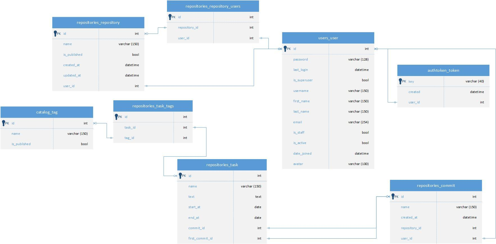

# Kanhub - сайт для управления задачами

## Содержание
- [Введение](#введение)
  - [Существующие решения](#существующие-решения)
  - [Возможности kanhub](#с-kanhub-вы-можете)
- [Структура проекта](#структура-проекта)
  - [Стек технологий](#используемые-фреймворки--библиотеки)
  - [База данных](#база-данных)
- [Развёртывание](#развёртывание)
- [Авторы](#авторы)

## Введение
Kanhub представляет собой сервис для управления задачами


### Существующие решения
Это не новая идея и уже существуют множество сервисов с похожим функционалом,
вот их небольшой срез: 

| Сервис                                      | Отслеживание прогресса | Календарь | История изменений	 | Коллаборация | Русский язык | API  |
|---------------------------------------------|-------------|---------------------|------------|--------------|---------|---------|
| [trello.com](https://trello.com/)  	      | Да (+)      | Да ($)             | Нет (-)     | Да (+)       | Нет (-) | Да (+)  |
| [todo.microsoft.com](https://todo.microsoft.com/)                   | Нет (+)     | Да (+)             | Нет (-)     | Нет (-)       | Да (+) | Нет (-)  |
| [notion.so](https://notion.so/)             | Да (-)      | Да (+)              | Да ($)     | Да ($)      | Нет (-) | Да (+)  |
| [basecamp.com](https://basecamp.com/)        | Да (-)      | Нет (+)              | Да ($)     | Да ($)      | Нет (-)  | Да ($)  |
| [rebrandly.com](https://www.rebrandly.com/) | Нет (+)     | Да (+)              | Да (+)     | Нет (-)      | Нет (-) | Да (+)  |
| [meistertask.com](https://www.meistertask.com/)          | Да (+)     | Да ($)              | Нет (-)     | Да ($)      | Нет (-) | Да (+)  |

(+) - функция есть; (-) - функции нет; ($) - функция платна

Kanhub предоставляет пользователю весь этот функционал!

### С Kanhub вы можете:
- Создавать задачи и устанавливать дедлайны
- Просматривать и управлять задачами с помощью удобного календаря
- Отслеживать историю изменений задач, чтобы видеть, какие правки были внесены
- Организовывать задачи по тегам для лучшей структуризации
- Совместно работать над задачами с коллегами в режиме реального времени
- Подключать интеграции через API для автоматизации управления задачами

## Структура проекта
### Используемые фреймворки / библиотеки
- [Bootstrap](https://getbootstrap.com/) - популярная (html / css / js) 
  библиотека для фронтенда
- [Django](https://www.djangoproject.com/) - основной фреймворк web сервиса

### База данных
Функциональная структура базы данных следующая:


## Развёртывание
### Инструкция по запуску проекта

Все команды вводятся в терминале</br>
***Необходимо иметь установленные pip и python для терминала***

#### Клонируем проект

```commandline
git clone https://gitlab.crja72.ru/django/2024/autumn/course/projects/team-4/
```

#### Переходим в папку team-4

```commandline
cd team-4
```

#### Создаём и активируем виртуальное окружение
Рекомендуется использовать виртуальное окружение для изоляции зависимостей:<br>
Для Windows:
```commandline
python -m venv venv
venv\Scripts\activate
```

Для MacOS/Linux:
```commandline
python3 -m venv venv
source venv/bin/activate
```

#### Устанавливаем зависимости

```commandline
pip install -r requirements/prod.txt
pip install -r requirements/dev.txt
pip install -r requirements/test.txt
pip install -r requirements/flake8.txt
```

#### Копируем в .evn из evn.example

- На Windows:
 ```bash
 copy .env.example .env
 ```
- На Mac или Linux:
 ```bash
 cp .env.example .env
 ```

Переменные KANHUB_DJANGO_YANDEX_CLIENT_ID и KANHUB_DJANGO_YANDEX_SECRET содержат данные от тестового аккаунта

#### Переходим в папку с manage.py

```commandline
cd kanhub
```

#### Настраиваем миграции

```commandline
python manage.py migrate
```

#### Скачиваем фикстуры

```commandline
python loaddata fixtures/data.json
```

#### Запускаем сервер 

```commandline
python manage.py runserver
```

#### Переходим на сайт

<a href="http://127.0.0.1:8000/">http://127.0.0.1:8000/</a>

***Терминал не закрываем!***

#### Тестирование

- Windows
  ```bash
  python manage.py test
  ```
- macOS или linux (Debian / Ubuntu)
  ```bash
  python3 manage.py test
  ```

### Возможные ошибки запуска
#### В случае возникновения ошибки с venv\Scripts\activate 

Решение проблемы:
- Открываем терминал PowerShell от админа.
- Вставляем и запускаем `Set-ExecutionPolicy RemoteSigned`
- На вопрос отвечаем `A`
- Продолжаем запускать проект по инструкции README.md с `Создаём и активируем виртуальное окружение`

#### Ошибка при загрузке requirements

Если у вас установлены несколько версий Python, используйте путь к нужной версии. Например, чтобы использовать Python 3.8, выполните команду:

**На Windows:**
```commandline
C:\path\to\python3.8\python.exe -m venv venv
```

Замените `C:\path\to\python3.8\python.exe` на путь к нужной версии Python, которую вы хотите использовать.

**На macOS/Linux:** <br>
Если у вас установлена нужная версия Python, вы можете использовать команду: <br>
```commandline
python3.8 -m venv venv
```

## Авторы:
<div style="display: flex; align-items: center;">
  <span style="margin-left: 10px;">Крахмальников Илья (<a href="https://github.com/124476">Github</a>)</span>
</div>
<br>
<div style="display: flex; align-items: center;">
  <span style="margin-left: 10px;">Хуснуллин Марсель (<a href="https://github.com/mario12508">Github</a>)</span>
</div>
<br>
<div style="display: flex; align-items: center;">
  <span style="margin-left: 10px;">Тараненко Максим (<a href="https://github.com/maxpawgdbs">Github</a>)</span>
</div>